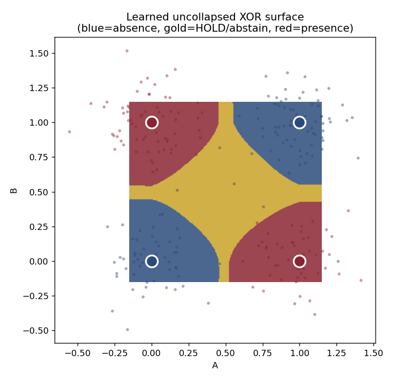

# uncollapsed

**Computation that keeps *presence* and *absence* apart, and collapses to a decision only at the edge — with a genuine, first-class _hold_.**

[](https://github.com/jfinst1/uncollapsed/actions/workflows/ci.yml)
[](https://www.python.org/)
[](LICENSE)
[](https://github.com/astral-sh/ruff)

A visible `0` is not one thing. In binary you never have to decide what `0` *means* — it's just "not‑1", off, false‑by‑default. Add a third possibility and `0` turns out to be **plural**: additive identity, false, unknown, null, high‑impedance, ground, abstain, origin. Those are different ideas wearing one glyph, and they don't share a truth table.

`uncollapsed` takes the middle seriously. It stops storing a single scalar in `[-1, +1]` and instead keeps **two independent non‑negative channels — presence and absence** — so four very different states can live behind the same visible `0`, and so a decision is a deliberate act at the boundary rather than a default that quietly happens.

```
      the same visible 0, four different inner states
      ┌────────────┬──────────┬──────────┬──────────────────────────┐
      │  void      │ presence │ absence  │  nothing there           │
      │  calm      │  small   │  small   │  low-energy balance      │
      │  conflict  │  high    │  high    │  both poles strong  ← !   │
      │  lean      │  differ  │  differ  │  a directional tilt      │
      └────────────┴──────────┴──────────┴──────────────────────────┘
```

<p align="center">
  
  <br>
  <em>A two-channel net learning noisy XOR — and learning <b>where to abstain</b>. The gold band is HOLD.</em>
</p>

📖 **Full documentation:** <https://jfinst1.github.io/uncollapsed/>

---

## Why

The whole point of reaching past binary is to get a **presence‑zero** — a held, positive, central state that actively means something — instead of the **absence‑zero** binary hands you (a pole, defined by negation, that quietly means "no"). Binary is impatient: every bit is a box already opened. `uncollapsed` is built to *hold the question open* and resolve only when there is real force to resolve it — and, crucially, never to default a genuine contradiction to "no".

See [`docs/theory.md`](docs/theory.md) for the full background.

## Install

```bash
pip install -e ".[dev]"      # from a clone
# or, minimal:
pip install -e .             # core (numpy only); add [viz] for the plot
```

## Quickstart

### The field algebra — reasoning about the middle

```python
from uncollapsed import UncollapsedField

void     = UncollapsedField.void()             # nothing there
calm     = UncollapsedField(0.18, 0.18)        # low-energy centre
conflict = UncollapsedField(0.90, 0.90)        # both poles strong
lean     = UncollapsedField(0.85, 0.35)        # a tilt toward presence

for f in (void, calm, conflict, lean):
    m = f.mass()
    print(f.icon().glyph(),                    # all four show "0" or a lean
          f"belief={m.belief:.2f} conflict={m.conflict:.2f} void={m.voidness:.2f}",
          "->", f.collapse().result.value)     # ... but collapse very differently
```

A balanced contradiction **holds** instead of collapsing, and — even under forced pressure — it **escalates** rather than defaulting to absence. Pressure is recorded, but it is not treated as evidence:

```python
from uncollapsed.field import CollapsePolicy

loaded = UncollapsedField(1.2, 1.2, pressure=1.0, pressure_bias=-1.0)
loaded.collapse(forced=True).result            # -> Collapse.ESCALATE  (never ABSENCE)

bad = CollapsePolicy(allow_pressure_to_break_ties=True)   # you have to *ask* for the bad behaviour
loaded.collapse(policy=bad, forced=True).result           # -> Collapse.ABSENCE
```

### The network — learning without collapsing

Hidden units carry `(presence, absence)` all the way through; only the output edge collapses. Synapses use one **signed weight whose sign swaps the channels** (balanced‑ternary negation), made differentiable.

```python
from uncollapsed.net import train, accuracy, grad_check

print(grad_check())                            # ~2e-9: analytical == numerical gradients

net, (_, _, Xte, yte) = train(epochs=3000)     # noisy XOR
accuracy(net, Xte, yte)                         # ~0.99 on UNSEEN noisy points => real learning
```

### CLI

```bash
uncollapsed --demo all
uncollapsed --demo learn --png surface.png
python -m uncollapsed --demo zero
```

## Results

Running `uncollapsed --demo learn`:

- **Gradient check: `max relative error ≈ 2e-9`.** The hand‑derived backprop matches numerical gradients — the learning is correct, not hand‑wavy.
- **Held‑out test accuracy ≈ 0.99** on noisy points the model *never saw during training*. Ninety‑nine percent on unseen data means it learned the XOR **function**, not a lookup table over four corners.
- **Learned abstention.** Trained purely to classify, the net is *overconfident* — it guesses at the ambiguous centre. Supervise the boundary toward `0.5` and it learns to **hold** exactly where XOR is genuinely undecided, while staying accurate on the clear corners (`~0.998`).

The gold band below is the region the trained model collapses to **HOLD** — it abstains precisely along the lines where the answer is undecided. That gold region *is* presence‑zero, learned from data.



## Four‑mass accounting

From the two channels (`sp = 1 - e^-presence`, `sa = 1 - e^-absence`):

| mass        | formula            | meaning                              |
|-------------|--------------------|--------------------------------------|
| `belief`    | `sp (1 - sa)`      | evidence *only* toward presence      |
| `disbelief` | `sa (1 - sp)`      | evidence *only* toward absence       |
| `conflict`  | `sp · sa`          | both strong — a loaded contradiction |
| `voidness`  | `(1 - sp)(1 - sa)` | both weak — nothing there            |

They sum to exactly 1 (the joint distribution of two independent Bernoulli channels). This is subjective‑logic / Dempster–Shafer flavoured, with two corrections that matter:

- **`expectation` projects both conflict *and* voidness to the base rate**, so a fully loaded contradiction reads `~0.5`, never `0.0`. A balanced "yes and no" is not secretly a "no".
- **`voidness` is high only when both channels are weak**, so a confident‑but‑quiet lean isn't mislabelled as mostly void.

## Roadmap

- [ ] Subjective‑logic‑exact conjunction/disjunction operators in `algebra.py`.
- [ ] **Unsupervised abstention** — hold driven by the field's own internal conflict, not by labels. (The interesting open problem.)
- [ ] Multi‑class / vector‑valued fields.
- [ ] A field‑gated readout layer usable as a drop‑in "I'm not ready to answer yet" head.

## Related ideas

This is not built in a vacuum. The two‑channel field is closely related to **subjective logic** (Jøsang's belief/disbelief/uncertainty opinions), **Dempster–Shafer evidence theory** (belief vs. plausibility, and conflict `K`), **intuitionistic fuzzy sets** (membership/non‑membership/hesitation), and **three‑valued logics** (Kleene, Łukasiewicz). The distinctive commitments here are keeping `conflict` and `voidness` first‑class, and treating collapse as an explicit edge operation that can legitimately abstain.

## Citing

```bibtex
@software{uncollapsed,
  author  = {Finstad, Jon},
  title   = {uncollapsed: presence/absence fields and edge collapse with a first-class hold},
  year    = {2026},
  url     = {https://github.com/jfinst1/uncollapsed}
}
```

## License

MIT — see [LICENSE](LICENSE).
# uncollapsed
# uncollapsed
# uncollapsed
