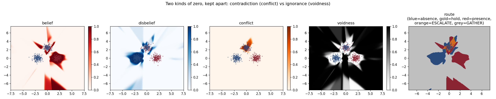

# Benchmarks

Every headline claim in this repository ships as a **pytest assertion**, not
prose. This page describes the shared protocol, the three benchmarks that
instantiate it, every result, and the honest boundaries. All numbers reproduce
from the commands shown (seed 0 unless stated; seeds 1–2 quoted where run).

## The two zeros protocol

Each benchmark builds a world containing three kinds of region and asks two
models to cope:

| region | what it is | correct behaviour |
| --- | --- | --- |
| **clear** | two classes with honest labels | classify; route to a lean |
| **conflict** | genuinely contradictory evidence | flag **and** route to `escalate` |
| **void** | no evidence at all | flag **and** route to `gather` |

The contenders are always a `FieldHead` and a **capacity-matched vanilla MLP**
(same hidden width, same optimizer, same budget) whose only uncertainty signal
is predictive entropy. The metrics:

1. **Clear accuracy** — both models must handle the easy part; nothing below
   is interesting if they can't.
2. **Flagging** — with each model's ambiguity threshold calibrated to at most
   5 % false-flags on clear validation points, what fraction of conflict /
   void points does it call "not a normal answer"?
3. **Triage AUC** — the headline. Among truly ambiguous points, how well does
   the model's signal separate conflict from void? The head scores on its
   `voidness` axis; the baseline scores on entropy, the only axis it has.
4. **Routing** — the fraction of each zone the head sends to its correct
   action (`gather` / `escalate` / lean).

A recurring result across all three benchmarks: the baseline's entropy is not
merely uninformative for triage — it is **inverted**. Off-manifold, a
sigmoid/softmax saturates, so the network reads *most confident precisely
where it knows least*. Void points score as certain; conflict points score as
uncertain; the ranking is backwards.

## 1 — Synthetic geometry (`bench`)

```bash
uncollapsed --demo triage --png masses.png
```

Two clear Gaussian clusters, a conflict cluster whose labels are drawn 50/50,
and a void ring at radius ~6 that no training point ever visits.

| metric (seed 0) | FieldHead | entropy baseline |
| --- | --- | --- |
| clear accuracy | 1.000 | 1.000 |
| conflict flagged | 1.000 | 1.000 |
| void flagged | 1.000 | 0.580 |
| **triage AUC** | **0.993** | 0.019 |
| void → `gather` | 0.930 | — |
| conflict → `escalate` | 0.755 | — |
| clear → lean | 0.998 | — |

Seed 7: triage 0.953 vs 0.151. Note the baseline is *confidently wrong* on
42 % of the void ring — it does not even flag it. Assertions:
`tests/test_head.py`.



## 2 — Real images, contradictory annotations (`realbench`)

```bash
uncollapsed --demo real                    # digits: sklearn built-in, no download
uncollapsed --demo real --dataset fashion  # Fashion-MNIST: fetched once, cached
```

Same protocol, no synthetic geometry. Two real classes form the clear task; a
third real class is presented with **contradictory duplication** (every sample
appears with both labels — two annotators, one disagreement; see
[Theory](theory.md#contradiction-you-cannot-memorize) for why random labels
would be a trap); the remaining classes are held out of training entirely as
**near-OOD void** — deliberately the hard kind, sharing pixel statistics with
the training data. Features are PCA-projected (fit on training data only) and
standardized; the head uses `bg_mode="shell"`.

| metric (seed 0) | digits — 3 vs 8, conflict = 5 | fashion — trouser vs boot, conflict = shirt |
| --- | --- | --- |
| clear accuracy | 0.977 | 0.998 |
| **triage AUC** — head / baseline | **0.908 / 0.231** | **0.704 / 0.281** |
| conflict → `escalate` | 0.736 | 0.976 |
| void → `gather` | 0.657 | 0.006 |

Digits repeats the synthetic story on real data (seeds 1–2: triage 0.915 /
0.916 against 0.215 / 0.188).

**Fashion maps the method's honest boundary.** Its held-out classes are
semantically entangled with the training classes, and nothing operating on
input density can call something "void" when it sits *on* the manifold. But
the failure is structured, not random — the per-class routing table (printed
by the demo) shows the head mapping unfamiliar inputs onto the semantic
structure it knows:

```
t-shirt/top  -> mostly escalate (0.98)   looks like shirt, the contested class
pullover     -> mostly escalate (0.97)
coat         -> mostly escalate (0.95)
sneaker      -> mostly absence  (0.98)   looks like an ankle boot, reads as one
```

Contested-looking things go to a human; boot-looking things read as boots.
What the head cannot do — what no input-density method can do — is detect
semantic novelty that overlaps the trained manifold. Assertions:
`tests/test_realbench.py` (the fashion test auto-skips offline).

## 3 — The two lieutenants on real telemetry (`faultbench`)

```bash
uncollapsed --demo faults
```

The two zeros as distributed-systems fault triage: **crash** (silence — the
`2f+1` fault) vs **Byzantine** (contradiction — the `3f+1` fault), on real
telemetry — the Intel Berkeley Lab deployment (Madden et al., 2004): 54 motes
reporting temperature every ~31 s, fetched once from a public mirror. There is
no public corpus of labelled naturally-occurring Byzantine faults, so per the
standard BFT / sensor-fusion methodology the *signal statistics are real* and
the *fault models are canonical injections*:

| injected as | model | role in the protocol |
| --- | --- | --- |
| **drift** | ±2.5–5 °C calibration bias | the benign, labelled clear-task fault |
| **Byzantine** | the mote replays its own trace from 12 h earlier — smooth, plausible, wrong thermal regime | conflict; labelled **both ways**, because from one observation you cannot tell whether this unit lies or its peers drifted — that *is* the two lieutenants problem |
| **crash** | 75–95 % of reports dropped, remnants genuine | void; never seen in training |

Instances are (mote, hour) windows featurized *against spatial peers* (report
rate, deviation from the peer-median trace, peer correlation, roughness,
spread, and excess deviation over the mote's own healthy baseline — computed
from training days only, because motes have persistent physical offsets and a
warm corner is not a fault). The split is **temporal**: train days 0–6, test
days 7–9.

| metric (seeds 0 / 1 / 2) | FieldHead | entropy baseline |
| --- | --- | --- |
| clear accuracy (healthy vs drift) | 0.880 / 0.883 / 0.871 | 0.863 / 0.879 / 0.851 |
| **triage AUC** — crash vs Byzantine | **1.000 / 1.000 / 1.000** | 0.064 / 0.030 / 0.000 |
| crash → `gather` | 1.00 / 1.00 / 1.00 | — |
| Byzantine → `escalate` | 0.93 / 0.88 / 0.94 | — |

The head's separation is perfect and the baseline's is perfectly inverted: a
monitoring system routing on that entropy scalar would **page a human for
dead batteries and quietly trust replayed telemetry**. Clear accuracy sits at
the same ~0.87 ceiling for both models — small drifts are genuinely
confusable with real thermal gradients (a sun-facing mote warming in the
afternoon), which is the honest residual, not a tuning artifact. Assertions:
`tests/test_faultbench.py` (auto-skips when the corpus is neither cached nor
downloadable).

## Reproducing everything

```bash
pip install -e ".[dev]"
pytest                      # 42 tests; data-dependent ones auto-skip offline
uncollapsed --demo triage
uncollapsed --demo real
uncollapsed --demo real --dataset fashion
uncollapsed --demo faults
```

Corpora cache to `~/.cache/uncollapsed` (`UNCOLLAPSED_CACHE` to override):
Fashion-MNIST ~30 MB, Intel Lab ~33 MB, digits none. Synthetic and digits
benchmarks run in seconds; fashion and faults in a couple of minutes each on a
laptop, dominated by the one-time download and parse.

## What would falsify this

Fair questions a skeptic should ask, and where the answers live:

- *"Is the baseline handicapped?"* — Same hidden width, same Adam, same epochs,
  same standardized features. Its entropy is calibrated to the same 5 %
  clear-region false-flag budget. It matches the head on clear accuracy
  everywhere.
- *"Is the conflict fitable noise?"* — Not under contradictory duplication;
  see [Theory](theory.md#contradiction-you-cannot-memorize). The random-label
  version *was* fitable (0.99 memorization) and was rejected for exactly that
  reason.
- *"Does the void result survive near-OOD?"* — Partially, and the boundary is
  documented rather than hidden: digits yes (0.91), fashion no (0.70, with the
  structured per-class routing shown above), telemetry yes (1.00 — crash
  features genuinely leave the manifold).
