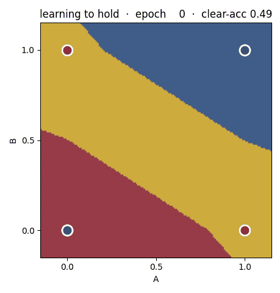

# uncollapsed

**Computation that keeps *presence* and *absence* apart, and collapses to a decision only at the edge — with a genuine, first-class _hold_.**

A visible `0` is not one thing. In binary you never have to decide what `0` *means* — it's just "not-1", off, false-by-default. Add a third possibility and `0` turns out to be **plural**: additive identity, false, unknown, null, high-impedance, ground, abstain, origin. Those are different ideas wearing one glyph, and they don't share a truth table.

`uncollapsed` stops storing a single scalar in `[-1, +1]` and instead keeps **two independent non-negative channels — presence and absence** — so four very different states can live behind the same visible `0`, and so a decision is a deliberate act at the boundary rather than a default that quietly happens.



## What's in the box

- **A field algebra** (`uncollapsed.field`, `uncollapsed.algebra`) — the `UncollapsedField` state, the four-mass accounting (belief / disbelief / conflict / voidness), NOT/AND/OR and fusion operators, and an edge-collapse policy that never silently defaults a balanced state to "no".
- **A trainable network** (`uncollapsed.net`) — hidden units carry `(presence, absence)` all the way through; only the output edge collapses; abstention is learned, not free.
- **A drop-in readout head** (`uncollapsed.head`) — bolt `FieldHead` onto any feature vector and get four masses per sample plus an explicit route: `presence` / `absence` / `hold` / `escalate` (contradiction — a human should look) / `gather` (no evidence — collect data).
- **Three benchmarks** (`bench`, `realbench`, `faultbench`) — synthetic geometry, real images with contradictory annotations, and crash-vs-Byzantine fault triage on real sensor-network telemetry. Every headline claim ships as a pytest assertion.

## Where to go next

- **[Theory](theory.md)** — why a `0` is plural, the four-mass accounting, the head's training objective, and the two lieutenants.
- **[Usage](usage.md)** — install, the field algebra, the network, and putting `FieldHead` on your own features.
- **[Benchmarks](benchmarks.md)** — the two zeros protocol, all results, honest boundaries, and how to reproduce every number.
- **[API reference](api.md)** — the full generated API.

## Install

```bash
pip install uncollapsed        # core (numpy only)
pip install "uncollapsed[viz]"   # + matplotlib plots
pip install "uncollapsed[bench]" # + scikit-learn (digits benchmark)
# or, from a clone:
pip install -e ".[dev]"
```

## The one-paragraph pitch

The whole point of reaching past binary is to get a **presence-zero** — a held, central state that actively means something — instead of the **absence-zero** binary hands you (a pole, defined by negation, that quietly means "no"). Binary is impatient: every bit is a box already opened. `uncollapsed` holds the question open and resolves only when there is real force to resolve it, and never defaults a genuine contradiction to "no".

## The one-table pitch

"I can't say" is **two different situations**, and they demand **opposite actions**:

| the zero you're looking at | what's underneath | the right next move |
| --- | --- | --- |
| **conflict** | strong evidence for *both* poles | `escalate` — a human decides |
| **voidness** | evidence for *neither* | `gather` — go collect data |

A single uncertainty scalar (entropy, max-softmax) can flag both and triage neither. Keeping two channels means conflict and voidness are *different numbers*, end to end. That's the library.
